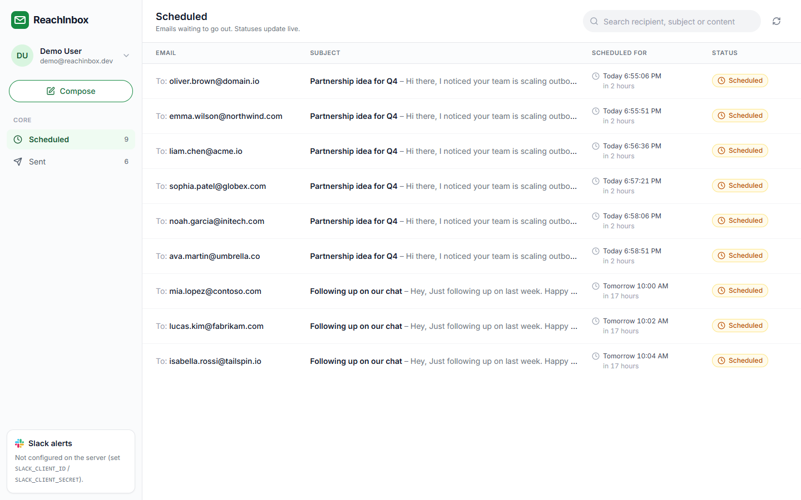
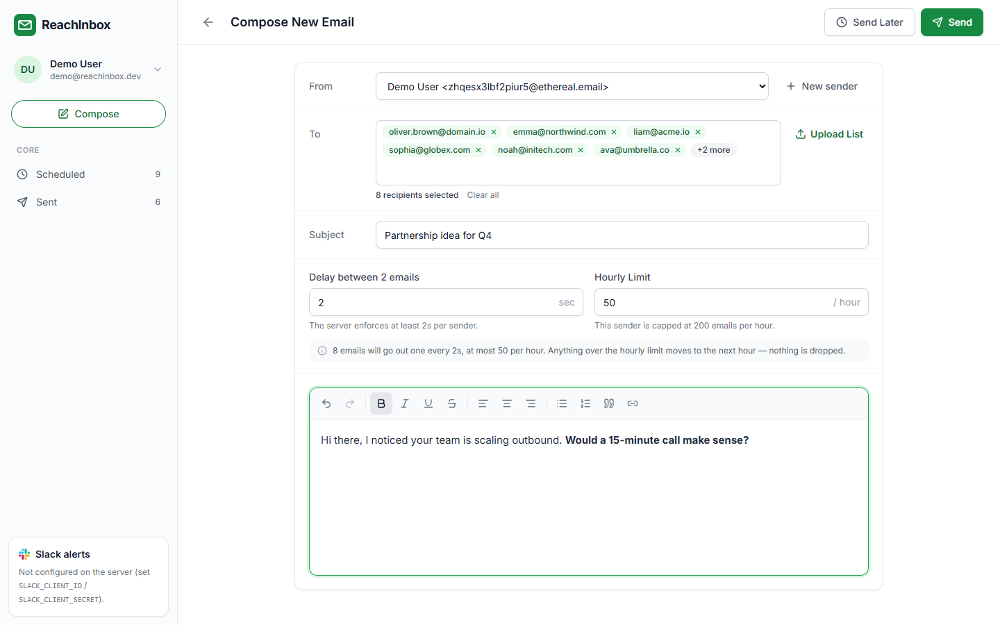

# ReachInbox Email Scheduler

My submission for the ReachInbox backend + frontend assignment. You log in with Google, write an email, upload a list of leads and pick when it should start. The backend schedules every email as a BullMQ delayed job (no cron), sends them through Ethereal SMTP while respecting per-sender rate limits, and posts to Slack when a sender hits its limit.

**Demo video:** _add link here_

| Scheduled | Compose |
| --- | --- |
|  |  |

More screenshots are in [docs/screenshots](docs/screenshots) (login, sent, search, send later, email detail, failed email, mobile, Bull Board).

## Stack

- **Backend:** Node 20, TypeScript, Express 5, BullMQ + ioredis, Postgres with Drizzle, Nodemailer (Ethereal), Elasticsearch 8, Zod, Pino
- **Frontend:** React 19, Vite, Tailwind 4, React Router, TanStack Query, TipTap for the editor
- **Infra:** Postgres 17, Redis 7.4 and Elasticsearch 8.19, all in `docker-compose.yml`

## Running it locally

You need Node 20.19+ and Docker.

```bash
docker compose up -d                    # Postgres on 5433, Redis on 6379, Elasticsearch on 9200
cp backend/.env.example backend/.env    # then fill in SESSION_SECRET + Google/Slack keys (see below)
npm install                             # npm workspaces, installs backend and frontend
npm run dev                             # API + worker + dashboard
```

Postgres runs on 5433 instead of 5432 so it doesn't clash with a local install.

- Dashboard: http://localhost:5173
- Health check (with queue counts): http://localhost:4000/api/health
- Bull Board: http://localhost:4000/admin/queues (also linked from the user menu)

Migrations run automatically on start-up and the Elasticsearch index is created the first time it's needed.

### Google login

1. In Google Cloud Console go to APIs & Services, set up the OAuth consent screen (External) and add your account as a test user.
2. Create an OAuth client ID of type "Web application":
   - JavaScript origin: `http://localhost:5173`
   - Redirect URI: `http://localhost:4000/api/auth/google/callback`
3. Put the client ID and secret in `backend/.env` (`GOOGLE_CLIENT_ID`, `GOOGLE_CLIENT_SECRET`).

The first time someone logs in, the backend creates the user and an Ethereal mailbox for them to send from.

### Slack alerts (optional)

1. Create an app at https://api.slack.com/apps and turn on Incoming Webhooks.
2. Under OAuth & Permissions add the redirect URL `https://localhost:4443/api/slack/callback` and the `incoming-webhook` scope.
3. Copy the client ID and secret into `backend/.env` (`SLACK_CLIENT_ID`, `SLACK_CLIENT_SECRET`).
4. In the dashboard click **Connect Slack** at the bottom of the sidebar and pick a channel.

Slack only accepts https redirect URLs, so in dev the API also listens on `https://localhost:4443` with a self-signed certificate it generates on first start. The first time Slack redirects there the browser shows a certificate warning; click through it (Advanced, then Proceed). If you'd rather use ngrok or cloudflared, point `SLACK_REDIRECT_URI` at the tunnel and set `HTTPS_DEV_PORT=0`.

If you want to connect a workspace other than the one the app was created in, enable public distribution in the Slack app settings.

### Ethereal

Nothing to set up. Ethereal is a fake SMTP service: it accepts mail but never delivers it. The backend creates accounts with Nodemailer's `createTestAccount()`, one per user plus any you add with **New sender** in the composer. Every sent email gets a preview link (**View on Ethereal** on the email's page) so you can see exactly what went out.

### Config

Everything is in `backend/.env` and validated with Zod at start-up. The main settings:

| Variable | Default | |
| --- | --- | --- |
| `WORKER_CONCURRENCY` | 5 | jobs processed in parallel per worker |
| `MIN_DELAY_BETWEEN_EMAILS_MS` | 2000 | min gap between two sends from the same sender |
| `MAX_EMAILS_PER_HOUR_PER_SENDER` | 200 | per-sender cap (a sender row can override it) |
| `MAX_EMAILS_PER_HOUR` | 0 | optional cap across all senders, 0 = off |
| `RATE_LIMIT_WINDOW_SECONDS` | 3600 | window length, see the tip below |
| `THROTTLE_INLINE_WAIT_MS` | 3000 | short waits are slept in the worker, longer ones park the job |
| `SEND_MAX_ATTEMPTS` / `SEND_RETRY_BACKOFF_MS` | 3 / 15000 | retries for temporary SMTP errors |
| `BULL_BOARD_USERNAME` / `BULL_BOARD_PASSWORD` | empty | optional basic auth for Bull Board |

The rest (ports, database/Redis/ES URLs, OAuth keys) are explained in [`backend/.env.example`](backend/.env.example). The frontend needs no config in dev because Vite proxies `/api` to the backend.

**Tip for trying out the limits:** waiting an hour for a window to roll over is slow, so I used `RATE_LIMIT_WINDOW_SECONDS=60` and `MAX_EMAILS_PER_HOUR_PER_SENDER=3` while testing and recording the demo. Same code path, just one-minute windows. Upload [`docs/sample-leads.csv`](docs/sample-leads.csv) (15 addresses) and you can watch 3 go out per minute.

### Other commands

```bash
npm run dev:api -w backend        # API only
npm run dev:worker -w backend     # worker only, you can start several
npm run build                     # esbuild for the backend, vite build for the frontend
npm run start -w backend          # run the built backend
npm run test                      # backend + frontend tests (needs docker compose up)
npm run reindex -w backend        # rebuild the Elasticsearch index from Postgres
npm run load-test -w backend -- --email you@gmail.com --count 1000 --campaigns 5
npm run token -w backend -- --email you@gmail.com   # session token for curl/Postman
```

`Ctrl+C` shuts down cleanly: it stops taking requests, waits for sends in progress, then closes connections.

## How it works

```
dashboard ──> Express API ──> Postgres (campaign + one row per email, in one transaction)
                   │
                   └──> BullMQ: one delayed job per email (jobId = email id) ──> Redis
                                                                                   │
                         worker <──────────────── job is due ──────────────────────┘
                           ├─ asks the Lua rate limiter in Redis for a send slot
                           ├─ claims the row in Postgres, sends via Ethereal SMTP
                           └─ Slack alert when a limit fills, ES index updated in the background
```

### Scheduling

When you hit Send or Send Later, `POST /api/campaigns`:

1. validates the request, lower-cases and dedupes the recipients and drops invalid addresses (they're reported back)
2. works out a send time for every email up front (`backend/src/scheduling/schedule-planner.ts`). Emails are spaced by the larger of the form's delay and `MIN_DELAY_BETWEEN_EMAILS_MS`, and at most min(form limit, sender cap, global cap) go into one window. The rest move to the next window in the same order. This way the dashboard shows realistic times straight away.
3. inserts the campaign and all email rows in one transaction
4. adds one delayed BullMQ job per email with `jobId = email id` and `delay = sendAt - now`. If Redis is down the rows are deleted again and the API returns 503, so nothing ends up half scheduled.
5. indexes the emails in Elasticsearch in the background

There's no cron and no polling loop anywhere. BullMQ's delayed jobs are the only timers.

### Restarts

Postgres is the source of truth for every email and its status. Redis holds the delayed jobs and the limiter counters, and runs with AOF persistence (`appendfsync everysec`) and `noeviction`, so jobs survive a Redis restart too.

If the server stops, the delayed jobs just sit in Redis. When it comes back, future emails go out at their original time, and anything that became due while it was down is sent right away (still within the limits).

On every start-up a reconciler (`backend/src/queue/reconcile.ts`) also goes through Postgres:

- every pending email gets its job re-added. Since the job id is the email id, existing jobs aren't touched. This covers a wiped Redis or a crash between the DB insert and the enqueue.
- jobs BullMQ gave up on (e.g. Postgres was down for all attempts) are retried if the email is still pending
- emails stuck in `sending` whose job is gone are marked failed (see below for why they aren't resent)

I tested this by hard-killing the process (not Ctrl+C) with 4 future emails queued and 3 more falling due during the downtime, then restarting 16 seconds later. The 4 future ones went out on schedule, the 3 overdue ones right after start-up, and all 7 had distinct Message-IDs with one attempt each.

### Never sending twice

A few layers make sure an email goes out at most once:

- **API:** the composer sends an `Idempotency-Key` header. Retrying with the same key returns the original campaign instead of scheduling it again.
- **DB:** unique `(campaign_id, recipient)`.
- **Queue:** `jobId = email id`, so adding the same email twice does nothing.
- **Worker:** before sending, it claims the email with `UPDATE emails SET status='sending' WHERE id=$1 AND status IN ('scheduled','rate_limited') RETURNING *`. Only one caller can win that, so duplicate jobs, retries and other workers get nothing back and skip.
- **Crash during SMTP:** if a worker dies after claiming but before saving the result, we can't know whether the mail went out. I mark it failed with a clear reason instead of resending (at-most-once). A normal Ctrl+C restart never hits this.
- The `Message-ID` is fixed per email (`<email-id@reachinbox-scheduler.local>`), so even if a duplicate ever did get through, the receiving side could dedupe it.

Temporary SMTP errors (network, 4xx) are retried with exponential backoff. Permanent ones (5xx, auth) fail immediately and the error is shown on the email's page.

### Rate limiting and concurrency

Each worker processes `WORKER_CONCURRENCY` jobs at a time, and you can run as many worker processes as you like. Nothing depends on in-memory state: the counters are in Redis and the claims are in Postgres.

When a job is due, the worker asks a Lua script in Redis (`backend/src/queue/rate-limiter.ts`) for a send slot. In one atomic step it checks:

- the per-sender cap: `ratelimit:s:{senderId}:count:{window}`
- the per-campaign cap (the Hourly Limit from the form): `ratelimit:c:{campaignId}:count:{window}`
- the optional global cap: `ratelimit:g:all:count:{window}`
- the minimum gap since the previous send from that sender (2s) and from that campaign (the form's delay)

It returns the earliest time that satisfies all of them and books it by incrementing that window's counters. Keys expire on their own after the window.

- **Waiting for the gap:** if the wait is short (up to `THROTTLE_INLINE_WAIT_MS`) the worker just sleeps. Otherwise it parks the job back in BullMQ's delayed set (`job.moveToDelayed`) with the reserved slot stored in the job data. That frees the worker for other senders and doesn't use up a retry attempt.
- **When a window is full:** the email isn't dropped or failed. The script walks forward to the next window with room and books the first free slot there. The email is marked `rate_limited` with its new time (you can see this in the dashboard) and parked until then. Jobs book slots in the order BullMQ releases them, so the overflow keeps its order and doesn't all fire at the start of the next window.
- **Window edges:** no send starts in the last 5 seconds of a window. Otherwise a send started at 10:59:59 could finish in the 11:00 window while being counted in 10:00. The planner uses the same rule so the plan and the runtime agree.
- **Why not BullMQ's built-in limiter?** It's per queue, not per sender, and it also counts jobs that only get rescheduled, so under load it would throttle the rescheduling itself.

**Under load:** I ran the load-test script with 1000 emails in 5 campaigns on the same sender, all starting at the same moment, with the sender capped at 30 per window. The API accepted all 1000 in 431 ms. Every window got exactly 30 sends, the overflow moved forward in order within each campaign, the campaigns were interleaved, and nothing failed or got sent twice.

### Slack

**Connect Slack** goes through Slack's OAuth v2 flow. The `state` is a signed token tied to the user and valid for 10 minutes. On the callback the backend stores that user's webhook URL and channel, then posts a confirmation message.

When a send fills the current window, or an email gets pushed out of a full one, the worker posts a message saying which limit was hit, how many emails are still queued and when sending resumes. There's one message per user, limit and window, deduplicated across workers with a Redis `SET NX`. Future windows that a backlog books ahead of time aren't announced, since that would just be noise.

The connection is looked up on every alert. If you haven't connected Slack the alert is skipped, and if you connect later it starts working straight away. If Slack says the webhook is gone (app removed or channel deleted) the connection is deleted and the dashboard shows Connect Slack again. Slack failures are only logged; they never delay or fail an email.

### Search

Each email is one document in the `emails` index, with recipient, subject, the start of the body, sender, status and dates. Recipient, sender and subject use an edge n-gram analyzer, so `acm` finds `jane@acme.io`. Results are always filtered by user and by tab.

Indexing happens in the background after each status change, so the index can lag about a second behind Postgres. If Elasticsearch is down, search falls back to an `ILIKE` query in Postgres and the UI says so. `npm run reindex` rebuilds the index from Postgres.

### Auth

Google login uses the authorization code flow with PKCE and a state value, both kept in a short-lived signed httpOnly cookie. The ID token is verified with `google-auth-library`. The session is a signed JWT (7 days) in an httpOnly, SameSite=Lax cookie. A Bearer token works too, for curl/Postman. Every query is scoped to the logged-in user.

## API

All routes are under `/api`. Errors look like `{ "error": { "code", "message", "details?" } }`.

| Route | |
| --- | --- |
| `GET /health` | DB / Redis / ES status and queue counts |
| `GET /config` | public limits the composer uses |
| `GET /auth/google`, `GET /auth/google/callback` | Google login |
| `GET /auth/me`, `POST /auth/logout` | current user, logout |
| `GET /senders`, `POST /senders` | list senders, create a new Ethereal sender |
| `POST /campaigns` | schedule emails (send an `Idempotency-Key` header) |
| `GET /emails?view=scheduled\|sent&q=&page=&pageSize=` | list, `q` searches Elasticsearch |
| `GET /emails/counts`, `GET /emails/:id` | sidebar counts, email detail |
| `GET /slack/status`, `POST /slack/install`, `GET /slack/callback`, `POST /slack/test`, `DELETE /slack` | Slack connection |

To try it with curl, log in once with Google, get a token with `npm run token -w backend -- --email you@gmail.com`, then:

```bash
curl -X POST http://localhost:4000/api/campaigns \
  -H "Authorization: Bearer $TOKEN" \
  -H "Content-Type: application/json" \
  -H "Idempotency-Key: demo-0001" \
  -d '{
        "senderId": "<id from GET /api/senders>",
        "subject": "Quick intro",
        "bodyHtml": "<p>Hi there!</p>",
        "recipients": ["alice@example.com", "bob@example.com"],
        "startAt": "2026-10-03T09:00:00Z",
        "delayBetweenEmailsSeconds": 5,
        "hourlyLimit": 50
      }'
```

The response includes the first and last send time, the delay and limit that were actually applied after the server's own caps, and any duplicate or invalid addresses that were skipped.

## Tests

```bash
docker compose up -d && npm run test
```

- Planner unit tests.
- Integration tests for the Lua rate limiter against the real Redis: gaps, caps per window, sender vs campaign vs global limits, no double counting, the window-edge rule, and a 60-way concurrent race that must never go over the cap or hand out the same slot twice.
- Frontend: pulling email addresses out of CSV/text.

Apart from the hard-kill and load tests above, I also checked by hand:

- two campaigns sharing a sender capped at 3 per window (sends went 3, 3, 2)
- one Slack alert per window, nothing for windows booked in advance
- a wrong SMTP password fails after one attempt with the error saved, and an unreachable host retries 3 times before failing
- `npm run build && npm start` runs on plain Node

## Project layout

```
backend/
  drizzle/        SQL migrations
  scripts/        load-test, reindex, issue-token, migrate
  test/           planner and rate limiter tests
  src/
    index.ts      API + worker in one process (api.ts / worker.ts run them separately)
    bootstrap.ts  start-up, reconciler, graceful shutdown
    scheduling/   send-time planner
    queue/        BullMQ queue, worker, processor, Lua rate limiter, reconciler, Bull Board
    services/     campaigns, emails, senders, Slack, limit alerts, search sync
    repositories/ all the SQL
    integrations/ Ethereal SMTP, Elasticsearch, Google OAuth, Slack API
    http/         Express app, routes, middleware
frontend/src/
  api/ hooks/     fetch client and TanStack Query hooks
  components/     layout, compose, email table, small UI pieces
  pages/          login, scheduled/sent list, compose, email detail
```

## Assumptions and trade-offs

**Assumptions**

- Each Google account is its own tenant. Senders, campaigns, emails and the Slack connection all belong to it.
- The form's delay and hourly limit apply per campaign. The server also enforces the per-sender gap and cap from `.env` (plus the optional global cap), and the strictest one wins. The response tells you what was actually applied.
- "Hourly" means fixed clock-hour windows (10:00-11:00), keyed by window + sender.
- Emails that fall due while the service is down are sent when it comes back, not skipped.

**Trade-offs**

- **At-most-once if a worker crashes mid-SMTP.** SMTP has no idempotency key, so if a worker dies in the second between claiming and saving the result, I mark the email failed rather than risk sending it twice.
- **The min delay is measured between send starts.** If one SMTP call is slow (usually the first one after a restart), the "sent at" times can end up closer together than the delay.
- **Some reordering after downtime.** Emails that all became due during an outage are processed `WORKER_CONCURRENCY` at a time and can swap places within that batch. Overflow from the hourly limit keeps its order.
- **Fixed windows** can let up to 2x the cap through around a boundary (200 at 10:59 and 200 at 11:00). A sliding window would fix that but needs more state.
- **No Redis Cluster.** The Lua script builds its keys at runtime, which is fine on standalone Redis or Sentinel (BullMQ needs that anyway) but not on Cluster without hash tags.
- **Elasticsearch isn't transactional with Postgres.** A failed index write is logged and `npm run reindex` fixes it. In production I'd use an outbox table or CDC.

**What I'd add with more time**

- Encrypt the SMTP credentials (they're Ethereal test accounts stored in plain text right now).
- Cancel/edit for scheduled emails, `{{firstName}}` style personalization, open/reply tracking.
- WebSockets or SSE instead of polling every 5 seconds.
- A session revocation list (logout currently just clears the cookie).
- Auth on Bull Board by default (right now it's only protected if you set the env vars).
